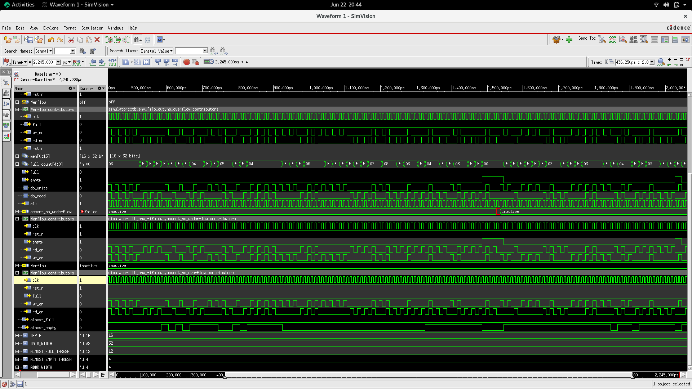
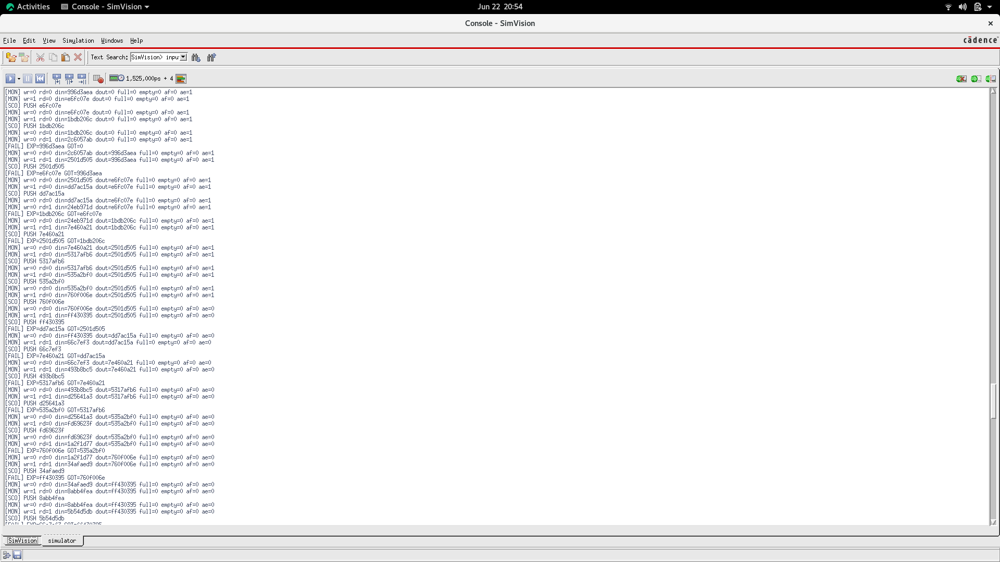
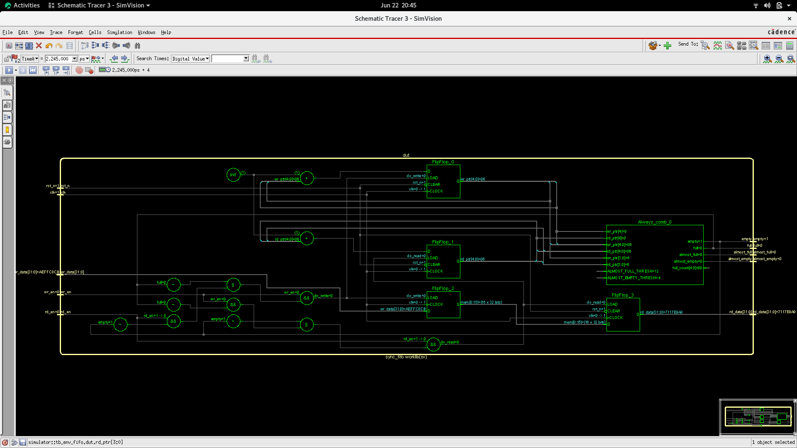

# SystemVerilog Synchronous FIFO

## Overview

This project implements a parameterized **Synchronous FIFO (First-In First-Out)** memory using **SystemVerilog** along with a verification environment and simulation results.

The FIFO supports configurable data width and depth, provides status flags, and includes assertion-based verification for overflow and underflow protection.

---

## Features

* Parameterized FIFO design
* Configurable DATA_WIDTH and DEPTH
* Synchronous read and write operations
* Full and Empty status flags
* Almost Full and Almost Empty indicators
* Overflow and Underflow protection
* Assertion-based verification
* Self-checking SystemVerilog testbench
* Cadence Xcelium and SimVision compatible

---

## FIFO Parameters

| Parameter           | Description            | Default Value |
| ------------------- | ---------------------- | ------------- |
| DATA_WIDTH          | Width of FIFO data bus | 32            |
| ADDR_WIDTH          | Address width          | 4             |
| DEPTH               | FIFO depth             | 16            |
| ALMOST_FULL_THRESH  | Almost Full threshold  | 12            |
| ALMOST_EMPTY_THRESH | Almost Empty threshold | 4             |

---

## Interface Signals

### Inputs

| Signal  | Description      |
| ------- | ---------------- |
| clk     | System clock     |
| rst_n   | Active-low reset |
| wr_en   | Write enable     |
| rd_en   | Read enable      |
| wr_data | Data input       |

### Outputs

| Signal       | Description            |
| ------------ | ---------------------- |
| rd_data      | Data output            |
| full         | FIFO full flag         |
| empty        | FIFO empty flag        |
| almost_full  | FIFO almost full flag  |
| almost_empty | FIFO almost empty flag |

---

## Verification Environment

The verification environment includes:

* Directed and random stimulus generation
* Write and read operation testing
* Full condition testing
* Empty condition testing
* Overflow protection checking
* Underflow protection checking
* Assertion-based verification

### Assertions

#### No Overflow

Ensures write operations are not accepted when FIFO is full.

#### No Underflow

Ensures read operations are not performed when FIFO is empty.

---

## Simulation Results

### FIFO Waveform



### Console Output



### FIFO Architecture



---

## Repository Structure

```text
.
├── sync_fifo.sv
├── tb_sync_fifo.sv
├── tb_env_fifo.sv
├── Schematic.png
├── console.png
├── tb_sync_fifo_waveform.png
└── README.md
```

---

## Tools Used

* SystemVerilog
* Cadence Xcelium
* Cadence SimVision
* Rocky Linux 8.10

---

## Running Simulation

Compile:

```bash
xrun sync_fifo.sv tb_sync_fifo.sv
```

Launch SimVision:

```bash
simvision &
```

---

## Future Improvements

* Asynchronous FIFO implementation
* UVM-based verification environment
* Functional coverage
* Scoreboard implementation
* Constrained-random testing
* Formal verification

---

## Author

Guru Vishnu

RTL Design and Verification Engineer (Learning Project)
